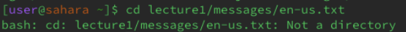
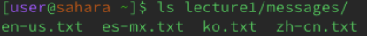
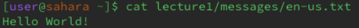

# **cd command with no arguments**

The current working directory is **/home**

Here the cd command does not change the current working directly and appears to do absolutely nothing.

This is no error. Without an argument, the cd command does nothing.

# **cd command with path to a directory as an argument**

The current working directory is **/home**

After running the cd command with **lecture1/messages/**, the command successfully changed the directory to **/lecture1/messages**. It shows this right next to "...sarah~".

This is no error because the command changed to the directory to the one desired

# **cd command with path to a file as an argument**

The current working directory is **/home**

After running the cd command with **lecture1/messages/en-us.txt**, the terminal informs us that the given path is not a directory. This is because the path is to a file within a directory.

There is no error, only on the side of the user.

---

# **ls command with no arguments**

The current working directory is **/home**

After running the ls command with no arguments, the terminal lists us in the folder **lecture1**. This is because it is the only folder or file in can find while in the **/home** directory.

There is no error. The command does exactly what is expected.

# **ls command with path to a directory as an argument**

The current working directory is **/home**

After running the command with a directory as an argument, the terminal lists the files in the given directory. 

There is no error. The command does exactly what is expected.

# **ls command with path to a file as an argument**

The current working directory is **/home**

After running the command with a file as an argument, the terminal returns the file name. This is because a file cannot have another file within it, and therefore the ls command will simply list the only file it can.

There is no error. The command does exactly what is expected.

---

# **cat command with no arguments**

The current working directory is **/home**

After running the command with no argument, the terminal appears to do absolutely nothing. Anything typed after this command is then repeated by the terminal and the terminal because useless.

I believe this may be an error. Avoid cat without arguments to avoid breaking the terminal!

# **cat command with path to a directory as an argument**

The current working directory is **/home**

After running the command with a directory as an argument, the terminal informs us that the argument is a directory. This is the terminal reminding the user that the command doesn't take in directories.

There is no error, the user simply needs to use the right type of argument.

# **cat command with path to a file as an argument**

The current working directory is **/home**

After running the command with a file as an argument, the terminal returns the contents of the file. This is because the cat command is meant to output the contents of multiple files, but it also works with one.

There is no error, but usually, the cat command uses more than one file!

