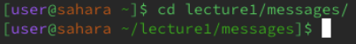
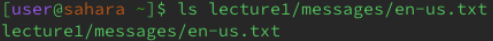
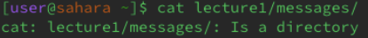

**cd command with no arguments**

The current working directory is **/home**

Here the cd command does not change the current working directly and appears to do absolutely nothing.

This is no error. Without an argument, the cd command does nothing.

**cd command with path to a directory as an argument**

The current working directory is **/home**

After running the cd command with **lecture1/messages/**, the command successfully changed the directory to **/lecture1/messages**. It shows this right next to "...sarah~".

This is no error because the command changed to the directory to the one desired

**cd command with path to a file as an argument**

The current working directory is **/home**

After running the cd command with **lecture1/messages/en-us.txt**, the terminal informs us that the given path is not a directory. This is because the path is to a file within a directory.

There is no error, only on the side of the user.

**ls command with no arguments**

**ls command with path to a directory as an argument**

**ls command with path to a file as an argument**

**cat command with no arguments**

**cat command with path to a directory as an argument**

**cat command with path to a file as an argument**

