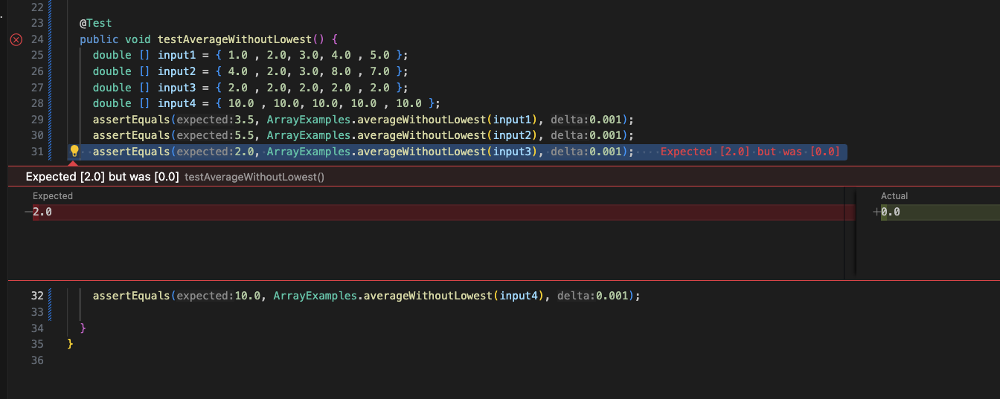

# LAB REPORT 3

## Part 1

**FAILURE INDUCING INPUT (an array of the same values):**

```
double [] input3 = { 2.0 , 2.0, 2.0, 2.0 , 2.0 };
double [] input4 = { 10.0 , 10.0, 10.0, 10.0 , 10.0 };
assertEquals(2.0, ArrayExamples.averageWithoutLowest(input3), 0.001);
assertEquals(10.0, ArrayExamples.averageWithoutLowest(input4), 0.001);`
```

**Input that doesn't induce a failure:**
```
double [] input1 = { 1.0 , 2.0, 3.0, 4.0 , 5.0 };
double [] input2 = { 4.0 , 2.0, 3.0, 8.0 , 7.0 };    
assertEquals(3.5, ArrayExamples.averageWithoutLowest(input1), 0.001);
assertEquals(5.5, ArrayExamples.averageWithoutLowest(input2), 0.001);
```
**Symptom:**



**BUG**

```
if(arr.length < 2) { return 0.0; }
  double lowest = arr[0];
  for(double num: arr) {
    if(num < lowest) { lowest = num; }
  }
  double sum = 0;
  for(double num: arr) {
  if(num != lowest) { sum += num; }
  }
  return sum / (arr.length - 1);
```

**BUG FIX**

```
static double averageWithoutLowest(double[] arr) {
    if (arr.length < 2) {return 0.0;}
    double sum = 0;
    //heres the changes
    double lowest = arr[0];
    for (double num: arr) {
      sum += num;
      if (num < lowest) {lowest = num;}
    }
    //basically the same, but the sum is diff
    //and we only subtract lowest once
    return (sum - lowest) / (arr.length - 1);
}
```
For fixing the bug, I decided to update the logic present when updating the `sum` field. Originally, the program would fail to account for the possibilty of multiple instances of the smallest value. This lead to an incorrect output when there were more than one of the same lowest value.
To fix this, I added all the values to the sum and simply waited until towards the end to remove the lowest value before diving the sum by the length of the array - 1. Now the program can correctly find the average of a list with multiple instances of the same smallest value, and even 
an array filled with only the same value.
## Part 2

### find -size

**find -size for a file larger than 100k:**
```
isidro@Isidros-MacBook-Pro docsearch % find ./technical -type f -size +100k 
./technical/government/About_LSC/commission_report.txt
./technical/government/About_LSC/State_Planning_Report.txt
./technical/government/Env_Prot_Agen/multi102902.txt
.........
```
In this example, the command outputs all the files in `/technical` that are larger than 100k. This could be useful to find large file in a specific directory. File size optimization?!?!??!


**find -size for a directory larger than 1M:**
```
isidro@Isidros-MacBook-Pro docsearch % find ./technical -type d -size +1M

```
In this example, the command outputs all directories within `/technical`, which appears to be none. I don't know if this is an error, because from the `du` command, I found directories that were in fact larger. The du (disk usage) command is used to estimate file and directory size for Unix-based systems.
The find -size commandcould be useful to learn which directories are large or small.

### find -mtime

**find -mtime for files modified within the last 5 days**

```
isidro@Isidros-MacBook-Pro docsearch % find ./technical/biomed -type f -mtime -5
./technical/biomed/1472-6807-2-2.txt
./technical/biomed/1471-2350-4-3.txt
./technical/biomed/1471-2156-2-3.txt
.....
```
In this example, the command outputs all the files the directory `/technical/biomed` that have been modified within the last 5 days. This could be useful in large group projects when someone wishes to learn 
which files, within a specific directory, have been recently updated.

**find -mtime for a directory modified within the last 5 days**

```
isidro@Isidros-MacBook-Pro docsearch % find ./technical -type d -mtime -5       
./technical
./technical/government
./technical/government/About_LSC
./technical/government/Env_Prot_Agen
./technical/government/Alcohol_Problems
./technical/government/Gen_Account_Office
./technical/government/Post_Rate_Comm
./technical/government/Media
./technical/plos
./technical/biomed
./technical/911report
```
In this example, the command outputs all the directories within `/technical` that have been modified within the last 5 days. This could be useful in large group projects when someone wishes to learn 
which directories have been recently updated.

### find -user

**find -user for files owned by Isidro (me)**
```
isidro@Isidros-MacBook-Pro docsearch % find ./technical/biomed -type f -user isidro
./technical/biomed/1472-6807-2-2.txt
./technical/biomed/1471-2350-4-3.txt
./technical/biomed/1471-2156-2-3.txt
......
```

In this example, the command outputs all the files the directory `/technical/biomed` that belong to me. This command option could be useful in large group projects when someone wishes to learn who owns a file within a specific directory.

**find -user for directories owned by Isidro (me)**

```
isidro@Isidros-MacBook-Pro docsearch % find ./technical/ -type d -user isidro      
./technical/
./technical//government
./technical//government/About_LSC
./technical//government/Env_Prot_Agen
./technical//government/Alcohol_Problems
./technical//government/Gen_Account_Office
./technical//government/Post_Rate_Comm
./technical//government/Media
./technical//plos
./technical//biomed
./technical//911report
```
In this example, the command outputs all the directories within `/technical` that belong to me. This command option could be useful in large group projects when someone wishes to learn who owns which directories..

### find -perm

**find -perm for files which the owner can read, write and execute commands in**
```
isidro@Isidros-MacBook-Pro docsearch % find ./technical/biomed -type f -perm -700
./technical/biomed/1472-6807-2-2.txt
./technical/biomed/1471-2350-4-3.txt
./technical/biomed/1471-2156-2-3.txt
......
```
In this example, the command outputs all the files within `/technical/biomed` which the owner can read, write, and execute commands in. This command option could be useful in large group projects when someone wishes to learn
who which files a user has permissions, and exact permissions.


**find -perm for directories which any user can read, write and execute commands in**
```
isidro@Isidros-MacBook-Pro docsearch % find ./technical -type d -perm -o=rx
./technical
./technical/government
./technical/government/About_LSC
./technical/government/Env_Prot_Agen
./technical/government/Alcohol_Problems
./technical/government/Gen_Account_Office
./technical/government/Post_Rate_Comm
./technical/government/Media
./technical/plos
./technical/biomed
./technical/911report
```
In this example, the command outputs all the directories within `/technical` which any user can read, write, and execute commands in. This command option could be useful in large group projects when they wish to 
learn which directories are public to any user.

## **Acknowledgement:**

For the second part of the assignment, I used ChatGpt with the following prompts:

```
"Give me 4 interesting command-line options to use the find command in java:"
```


```
"More more more"
```

ChatGpt provided me with many examples for this assignment, and I changed up some numbers for this assignment. Below is some of what ChatGPT provided me: 

```
-type: This option allows you to specify the type of file to search for, such as regular files (f), directories (d), symbolic links (l), etc.
bash
# Find all regular files in the ./technical directory
find ./technical -type f

# Find all directories in the ./technical directory
find ./technical -type d
-name: This option allows you to search for files or directories with a specific name pattern.
bash
# Find all files with the name "README.md" in the ./technical directory
find ./technical -type f -name "README.md"
.....
```

