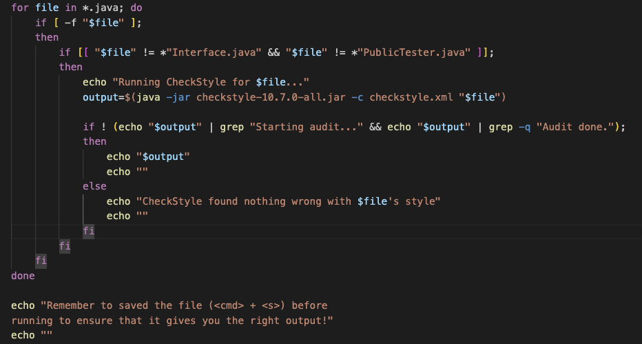
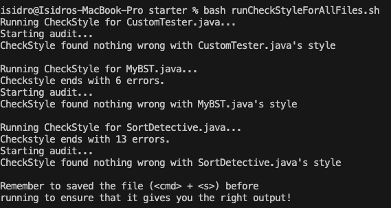

# Lab Report #5

## **PART ONE**

### Student post:

**Isidro Hernandez Cardenas**

Hello!

I was working on a bash script for CheckStyle (from CSE 12) in order to run the program on every java file in the current directory in order to quickly see style issues. 
I suspect that maybe the if-statements need to be changed, but I have tried changing them multiple times. 

I cannot upload a screenshot of the java files I used to produce the symptoms, 
because of Academic integrity… The bug should also have nothing to do with the java files.

Here's the script:

Current working directory: 

`/Users/isidro/Downloads/cse12-wi24-pa8-BinarySearchTree-Sorting-starter-main/starter`
(where my java and script files are)

Here's the command:

`bash runCheckStyleForAllFiles.sh`

Here's the output:

### TA reply:

Hi, nice start to a bash script.

Based on the behavior in the screenshot you provided us, it looks like the else statement runs for every single .java file that fits the second if condition (on line 4). 
This is because you are running the command every single time you assign it to `output`. To capture the output of the command without actually running try using `2>&1`. 
By using `2>&1`, both the output and any error messages produced by the command are captured and stored in the `output` variable. The second bug with your bash script 
has to do with your if condition (on line 9) when you are checking the output of the command in order to only echo it when there are errors with the file’s style. 
I would approach this by checking for a pattern in the output. Try something like `grep -q “.....”. Good work and goodluck!

## **PART TWO**

In the second half of this quarter, I found it most interesting learning about bash scripts and being assigned to write a bash script that related to us, even if only a 
few of us might actually create PA grades in the future of our time here at UCSD. I just felt that bash scripts did in fact save us time, and of course many of the skills
we learn do, but it felt so easy to think of its practical uses. For example, I didn’t like how in CSE 12, in order to use CheckStyle we basically had to find the website
for the command to run it. I ended up creating two bash scripts, one for running CheckStyle on a single file and another for checking all the files that end with .java. 
Before starting this assignment, the second one was buggy and now it works really well and even added colored text!
