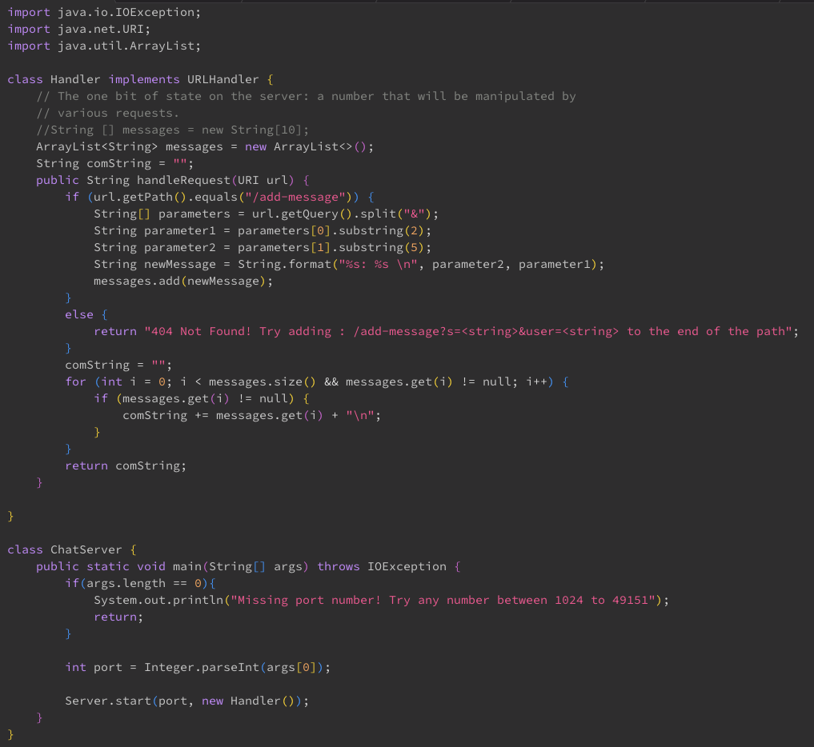

## LAB 2

## Part 1

# **My Code**

# **UPDATED Code**

# `1st Screenshot: Using /add-message?s=This%20is%20a%20test&user=Isidro`

**Description of my code:**

My program stores messages in the string ArrayList `messages` and initiates a string field named `compMessage`, which together will be used to output the messages the server inputs. The use of an ArrayList allows the program to store several messages, which is essential in communication. 
Inside the handler class, the `handleRequest` method takes the url of type URI as a parameter, and looks for the `/add-message` path. If found, the program looks for the query and seperates it into two parameters, other wise the website will display "404 not found....".
After being split, the two parameters are then substringed to create the desired arguements. These are then stored into two seperate fields. To create the actual message that will be displayed, the program combines the fields
into a new string field: `newMessage`. This `newMessage` string is stored as an element within the `messages` ArrayList. Towards the end, there is a for loop that adds the messages into the `comMessage` string, which is then returned after the loop is exited. This output is the complete message history.

#  **2nd Screenshot: Using /add-message?s=No&user=PizzaMan2904**

The second time this program is ran is almost identical to the first time. Thhe `handleRequest` method once again takes in the url of type URI as a paramater and look for the `/add-message` path and creates the appropiate arguements from what it finds as before. The difference is that the `messages` ArrayList expands by one and also stores a new element, which is of course the new message. Later on, the for loop that adds onto the `comMessage` string also runs one more time than before in order to get all the messages it needs before the program outputs it. 

---

## Part 2

**Absolute path of my private SSH key**

**Absolute path of my public SSH key**

**Logging into ieng6 WITHOUT a password**

---

## Part 3

---

I believe that the 2nd and 3rd lab were really useful in introducing us to webservers. Other than some of the code I didn't understand, mostly the content of the server.java, I didn't really how easy it was to create a webserver. 
It brought me some genuine curiosity about webservers. The labs also reinforced my understanding of query, paths and other terms we covered in lecture.
