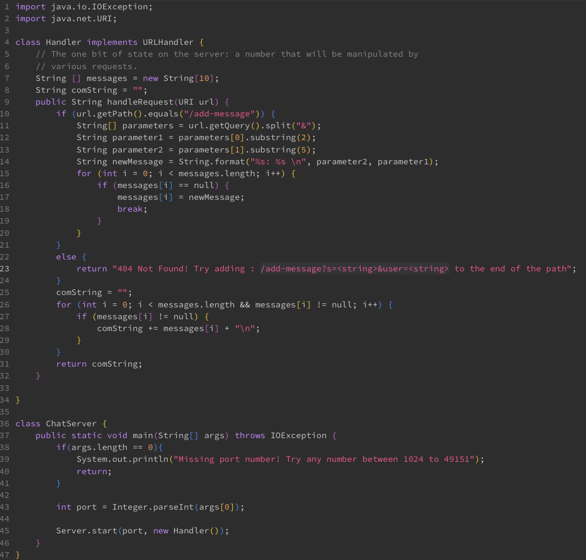
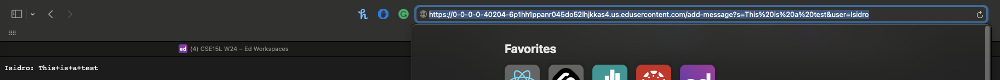
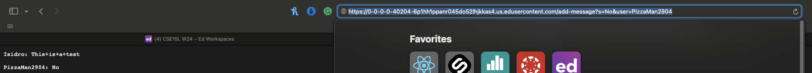
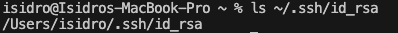
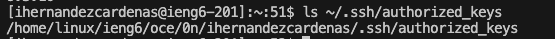
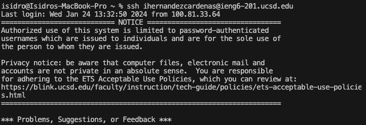

## LAB 2

## Part 1

# **My Code**

# **1st Screenshot: Using /add-message?s=This%20is%20a%20test&user=Isidro**

**Description of my code:**

My program stores messages in the string array **messages** and initiates a string field named **compMessage**, which together will be used to output the messages the server inputs. 
The program starts by taking in the URL, and looks for the */add-message* path. If found, the program looks for the query and seperates it into two parameters, other wise the website will display "404 not found....".
After being split, the two parameters are then substringed to create the desired arguements. These are then stored into two seperate fields. To create the actual message that will be displayed, the program combines the fields
into a new string field: newMessage. This newMessage string is stored as an element within the **messages** array. Towards the end, there is a for loop that adds the messages into the **comMessage&& string, which is then returned after the loop is exited.

#  **2nd Screenshot: Using /add-message?s=No&user=PizzaMan2904**

The second time this program is ran is almost identical to the first time. In fact, it runs simarily every time it runs. The only difference is that the **messages** array has one more element occupying it, 
and therefore the comMessage string has more messages to temporarily store in order to output all the stored messages.

---

## Part 2

**Absolute path of my private SSH key**

**Absolute path of my public SSH key**

**Logging into ieng6 WITHOUT a password**

---

## Part 3

---

I believe that the 2nd and 3rd lab were really useful in introducing us to webservers. Other than some of the code I didn't understand, mostly the content of the server.java, I didn't really how easy it was to create a webserver. 
It brought me some genuine curiosity about webservers. The labs also reinforced my understanding of query, paths and other terms we covered in lecture.
