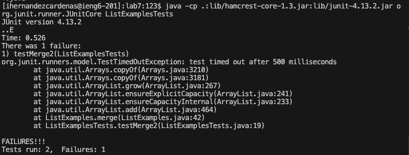
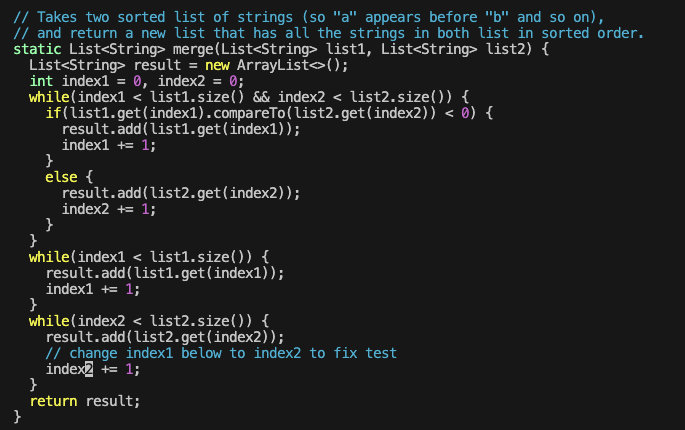
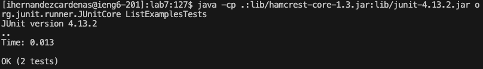
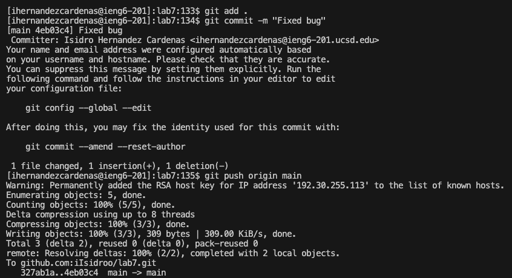

# LAB REPORT 4

## STEP 4 (Log into ieng6):
Keys pressed: 

`<Ctrl> <r> <s> <s> <Tab> <Enter>`

Since I have already signed into ieng6 plenty of times, 

it was appropriate to use the command history to avoid typing out the entire command.

## STEP 5 (Clone your fork using your SSH URL):
Keys pressed: 

`<Ctrl> <r> <g> <i> <t> <Space> <c> <l> <Tab> <Enter>`

Like before, I have already used the command before so I took advantage of the command history.

## Step 6 (Running the tests): 

Keys pressed:

`<c> <d> <Space> <l> <Tab> + <Enter>`

`<Ctrl> <r> <j> <a> <v> <a> <c> <Tab> <Enter>`

`<Ctrl> <r> <j> <a> <v> <a> <Space> <Tab> <Enter>`

Once again I used command history to avoid typing out long commands. 

The first time around I would have had to look for the command and copy and paste it,

which would have taken significantly longer.

## Step 7 (Debugging): 

Keys pressed: 

`<Ctrl> + < r > < v>  <i> + <Tab>`

`<:> <4> <4> <Enter> + <e> + <r> <2>`

`<:> <x> <Enter>`

I used the command history to enter vim. From there I already knew that the bug was at 

the end of the first word on line 44 so I used `<:44>` to quickly get to said line and 

`<e>` + `<r2>` to replace the last character of the first word with “2”.

## Step 8 (Running the tests again): 

Keys pressed: 

`<Up> <Up> <Up> + <Enter>`

`<Up> <Up> <Up> + <Enter>`

Since I had just used the commands, they were just a few up in the search history, 

so used the up arrow to access them.

## Step 9 (Committing and pushing the new changes):

Keys pressed: 

`<g> <i> <t> <Space> <a> <d> <d> <Space> <.> + <Enter>` 

`//the search seemed to bug out for this. Either way this command is really easy to type out…`

`<Ctrl> <r> <-> <m> + <Tab> <Enter>`

`<Ctrl> 
 <u> + <Tab> <Enter>`

For committing and pushing, I just used the command history to quickly find and utlize the commands.

I didn't do this for the add command because I was having more trouble with it than it wasn't worth

continuing to deal with the issue when the command is so short.
