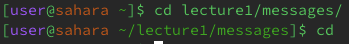
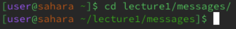
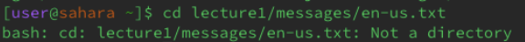
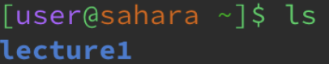
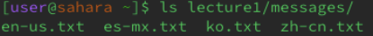
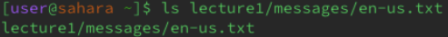
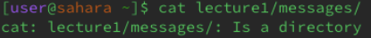
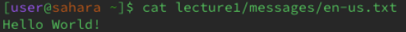

### **`cd` Command With No Arguments**

The current working directory is `/home`

Here the cd command does not change the current working directly and appears to do absolutely nothing.

Take #2: Current Working Directory `/home/lecture1/messages/`

Here the command simply sets the working directory to the home directory. 

### **`cd` Command With Path to a Directory As An Argument**

The current working directory is `/home`

After running `cd lecture1/messages/`, the command successfully changed the directory to `lecture1/messages`. It shows this right next to "...sarah~".

This is no error because the command changed to the directory to the one desired

### **`cd` Command With A Path to a File As An Argument**

The current working directory is `/home`

After running `cd lecture1/messages/en-us.txt`, the terminal informs us that the given path is not a directory. This is because the path is to a file within a directory.

An error occurs. This is because the `cd` isn't designed to take file as an argument. The terminal informs the user of how to use the command correctly.

---

### **`ls` Command With No Arguments**

The current working directory is `/home`

After running the ls command with no arguments, the terminal lists us in the folder `lecture1`. This is because it is the only folder or file in can find while in the `/home` directory.

There is no error. The command does exactly what is expected.

### **`ls` Command With Path to a Directory As An Argument**

The current working directory is `/home`

After running `ls lecture1/messages/`, the terminal lists the files in the given directory. 

There is no error. The command does exactly what is expected.

### **`ls` Command With A Path to a File As An Argument**

The current working directory is `/home`

After running `ls lecture1/messages/en-us.txt`, the terminal returns the file name. This is because a file cannot have another file within it, and therefore the ls command will simply list the only file it can.

There is no error. The command does exactly what is expected.

---

### **`cat` Command With No Arguments**

The current working directory is `/home`

After running the command with no argument, the terminal appears to do absolutely nothing. It isn't until after attempting to type more into the terminal, that a strange behaviour occurs. Anything typed after this command is then repeated by the terminal and the terminal because useless, or does it.

There is no error, because this is actually a feature of the cat command. From what I found on the internet, it appears that this is supposed to help programmers cat multiple files. I tried to use this behaviour with text files, but was unsucessful in both edStem and VSCode.

### **`cat` Command With Path to a Directory As An Argument**

The current working directory is `/home`

After running `cat lecture1/messages/`, the terminal informs us that the argument is a directory. This is the terminal reminding the user that the command doesn`t take in directories.

An error occurs because the `cat` command is not designed to use directories as arguments. In the terminal, the user is told to use a file instead.

### **`cat` Command With A Path to a File As An Argument**

